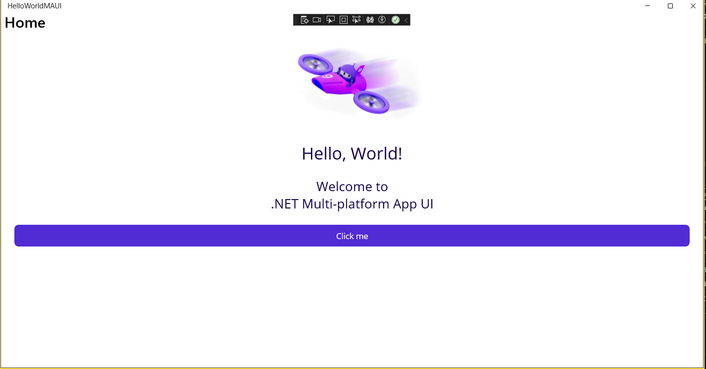
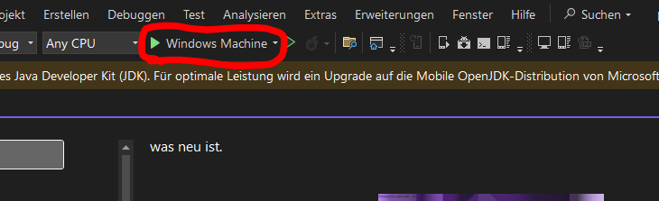

# Arbeitsjournal  FB10 Melvin Volmar

Datum: 04.07.2025

---

## Beschreibung der Phase 1:
Die Aufgabe war, alles für den Projektstart vorzubereiten. Dafür mussten Visual Studio und die .NET MAUI-Komponenten installiert werden. Danach sollte eine einfache Test-App („Hello World“) erstellt und im Emulator getestet werden. Wenn alles funktionierte, wurde das Projekt auf GitHub unter dem Namen „HelloWorldMAUI“ hochgeladen. Zum Schluss wurde das Ergebnis der FW-Leitung vorgestellt und das Okay für die nächsten Schritte eingeholt.

## Beschreibung der Phase 5:
In dieser Phase beschäftige ich mich mit dem Code eines anderen Projektteams - in diesem Fall mit dem Projekt von Herr Günes. Ich lade dessen Repository herunter, teste die Funktionsweise und dokumentiere meine Ergebnisse. Besonders spannend wird es, wenn ich in einem eigenen Branch experimentieren und kleine Änderungen vornehmen darf - etwa das Design anpassen oder neue Funktionen ausprobieren.

---

## Phase 1: Projektstart und Einrichtung (04-07-2025)

Tätigkeiten:
- Die Projektbeschreibung wurde gelesen und verstanden.
- .NET Mauji wurde erstellt und erfolgreich angezeigt:

- Die Dokumentation (README_Projektjournal.md) wurde erstellt.

  Ausführen:

    1. Zuerst öffnet man Visual Studio.
    2. Danach wählt man das Projekt aus.
    3. Zum Schluss drückt man oben auf den grünen Play Button.

Bemerkungen:
- Die Einrichtung verlief ohne grössere Schwierigkeiten.

---

## Phase 5: Qualitätssicherung durch Peer Review (09-07-2025)

Tätigkeiten:
-

Bemerkungen:
- 
